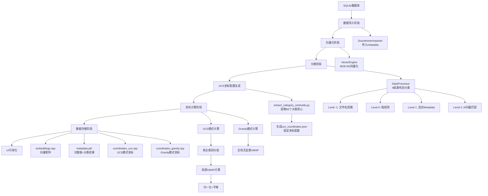

# 完整数据流程文档

**版本**: v1.0

**最后更新**: 2025-01-10

**目的**: 详细说明从数据库到UCS模式测试的完整端到端流程，重点阐述锚点、UMAP和数据的先后关系

---

## 概述

本文档描述 Sonic Compass 从 SQLite 数据库开始，到最终构建完整 UCS 模式可视化地图的完整数据流程。重点说明**定锚群岛策略（Fixed Archipelago Strategy）**中的锚点、UMAP 计算和数据的先后关系。

---

## 完整流程图



---

## 阶段1: 数据源准备

### 1.1 SQLite 数据库结构

**数据库文件**: 通过 `data_config/user_config.json` 配置，默认 `./test_assets/Sonic.sqlite`

**核心表**: `files` 表，包含以下关键字段：

-`filename`: 文件名

-`description`: 描述

-`keywords`: 关键词

-`category`: 原始类别（可选）

-`path`: 文件路径

- 其他 metadata 字段

**数据规模**: 支持 200万+ 音频资产

---

## 阶段2: 数据导入阶段

### 2.1 导入流程

**脚本/模块**: `data/importer.py` (SoundminerImporter)

**功能**:

1. 从 SQLite 数据库读取 metadata
2. 构建 `rich_text`（富文本上下文）：

   - 拼接 `Filename`, `Description`, `Keywords`, `VendorCategory`, `Library`, `BWDescription`, `Notes`, `FXName`
   - 用于分类和向量化
3. 数据验证和清洗

**输出**:

-`metadata_list`: List[Dict]，包含所有文件的 metadata

**示例**:

```python

metadata =[

    {

        "filename": "ANMLAqua_Whale_01.wav",

        "description": "Blue whale underwater vocalization",

        "keywords": "whale, ocean, underwater",

        "category": "",  # 原始category可能为空

        "path": "/path/to/file.wav",

        "rich_text": "ANMLAqua_Whale_01.wav Blue whale underwater vocalization whale ocean underwater"

    },

    # ... 更多文件

]

```

**数据顺序**: 按数据库查询顺序，保持索引一致性

---

## 阶段3: 向量化阶段

### 3.1 向量化流程

**脚本/模块**: `core/vector_engine.py` (VectorEngine)

**功能**:

1. 使用 BGE-M3 模型将 `rich_text` 编码为向量
2. 向量维度: 1024 维
3. GPU 加速（如果可用）

**输入**:

-`metadata_list`: 包含 `rich_text` 字段

**输出**:

-`embeddings.npy`: 向量矩阵 (N, 1024)，N 为文件数量

**关键点**:

- ✅ **向量顺序与 metadata 顺序完全一致**：`embeddings[i]` 对应 `metadata[i]`
- ✅ **索引关系**: 索引 `i` 在整个流程中保持不变
- ✅ **缓存机制**: 向量化结果保存到 `cache/embeddings.npy`，避免重复计算

**数据存储**:

```python

# cache/embeddings.npy

# Shape: (N, 1024)

# embeddings[0] 对应 metadata[0] 的向量

# embeddings[1] 对应 metadata[1] 的向量

# ...

```

---

## 阶段4: 分类阶段

### 4.1 分类流程

**脚本/模块**: `core/data_processor.py` (DataProcessor)

**功能**: 4级瀑布流分类逻辑，从最高确定性到最低确定性

**分类优先级**:

1.**Level -1**: 文件名短路（从文件名提取 CatID，如 `ANMLAqua_Whale_01.wav` → `ANMLAqua`）

2.**Level 0**: 强规则（从 `rich_text` 中查找关键词，使用 `data_config/rules.json`）

3.**Level 1**: 显式 Metadata（验证原始 `category` 字段）

4.**Level 2**: AI 向量匹配（使用 Platinum Centroids，相似度 > 0.4）

**输入**:

-`metadata_list`: 包含 `rich_text` 和 `category` 字段

-`data_config/rules.json`: 关键词到 CatID 的映射

-`cache/platinum_centroids_754.pkl`: 754 个 UCS CatID 的向量质心

**输出**:

-**更新 metadata**: 每个 metadata 增加 `category` 字段（CatID）

- 分类来源标记（用于调试）

**关键点**:

- ✅ **分类顺序与向量顺序一致**：`metadata[i]` 的分类结果对应 `embeddings[i]`
- ✅ **主类别提取**: CatID → 主类别（Main Category），例如 `ANMLAqua` → `ANIMALS`
- ✅ **分类结果影响坐标计算**: UCS 模式根据主类别分组数据

**示例**:

```python

metadata[0]= {

    "filename": "ANMLAqua_Whale_01.wav",

    "category": "ANMLAqua",  # Level -1 分类结果

    "main_category": "ANIMALS",  # 从 CatID 提取

    # ... 其他字段

}

```

**数据存储**:

```python

# cache/metadata.pkl

# 包含更新后的 metadata，每个条目都有 category 字段

```

---

## 阶段5: UCS坐标配置生成阶段（关键：锚点定义）

### 5.1 配置生成流程

**脚本**: `tools/extract_category_centroids.py`

**功能**: 从现有坐标数据提取 82 个大类的质心和半径，生成 UCS 坐标配置

**输入**:

-`cache/coordinates_ucs.npy` 或 `cache/coordinates.npy`（坐标数据，如果有）

-`cache/metadata.pkl`（元数据，包含分类结果）

-`data_config/ucs_catid_list.csv`（UCS标准定义，包含82个大类）

**处理流程**:

1.**加载数据**:

- 优先加载 `coordinates_ucs.npy`（UCS模式坐标）
- 如果不存在，回退到 `coordinates.npy`（旧坐标）
- 加载 `metadata.pkl` 获取分类结果

2.**按主类别分组**:

- 根据 `metadata[i]['category']` → 主类别
- 将所有同一主类别的数据索引分组

3.**计算质心**（使用中位数）:

- 对每个大类，计算坐标的中位数（Median）
- 避免离群点影响

4.**计算半径**（Robust方法）:

- 使用 1.5×IQR 过滤离群点
- 使用 2%-98% 分位数范围计算半径
- 最大值限制：300.0

5.**计算 gap_buffer**（自适应）:

- radius < 50: 15%
- radius 50-200: 12%
- radius > 200: 10%

6.**处理无数据类别**:

- 对于没有数据的82个大类，设置默认值：`(0, 0)` 和 `radius = 15.0`

**输出**:

-`data_config/ucs_coordinates.json`: UCS坐标配置

**配置格式**:

```json

{

  "ANIMALS": {

    "x": 2747.198486328125,

    "y": 189.91506958007812,

    "radius": 286.5151000976563,

    "gap_buffer": 28.65151000976563,

    "description": "ANIMALS 大类",

    "count": 323,

    "has_data": true

  },

  "WEAPONS": {

    "x": 1500.0,

    "y": 1500.0,

    "radius": 200.0,

    "gap_buffer": 20.0,

    "description": "WEAPONS 大类",

    "count": 0,

    "has_data": false

  }

  // ... 其他80个大类

}

```

**关键点**:

- ✅ **锚点定义**: 82个大类的固定坐标（`x`, `y`）就是"锚点"
- ✅ **先有数据，后有锚点**: 首次运行时，如果已有旧的坐标数据，可以从中提取锚点
- ✅ **首次运行**: 如果没有旧坐标数据，可以手动定义锚点，或使用默认值（`(0, 0)`）
- ✅ **锚点可调整**: 生成后可以手动编辑 `ucs_coordinates.json` 调整布局

**数据顺序关系**:

- ⚠️ **此阶段不依赖数据顺序**：只统计每个大类有多少数据点，计算大类的中心位置
- ⚠️ **锚点位置是固定的**：每个大类有一个固定的坐标，与数据点索引无关

---

## 阶段6: 坐标计算阶段（核心：定锚群岛策略）

### 6.1 UCS模式坐标计算

**脚本/模块**: `core/layout_engine.py` (compute_ucs_layout)

**功能**: 实施定锚群岛策略，确保0%漂移

**输入**:

-`cache/embeddings.npy`: 向量矩阵 (N, 1024)

-`cache/metadata.pkl`: 元数据，包含分类结果

-`data_config/ucs_coordinates.json`: UCS坐标配置（锚点定义）

**处理流程**:

#### 步骤1: 加载锚点配置

```python

coordinates_config =load_ucs_coordinates_config("data_config/ucs_coordinates.json")

# 返回: {"ANIMALS": {"x": 2747.0, "y": 189.0, "radius": 286.5, ...}, ...}

```

#### 步骤2: 按主类别分组数据（基于分类结果）

```python

category_groups =defaultdict(list)  # {category_name: [indices]}


for i, meta inenumerate(metadata):

    cat_id = meta['category']  # 例如: "ANMLAqua"

    main_category = ucs_manager.get_main_category_by_id(cat_id)  # 例如: "ANIMALS"

    category_groups[main_category].append(i)  # 将索引 i 添加到 ANIMALS 组


# 结果:

# category_groups = {

#     "ANIMALS": [0, 5, 12, 23, ...],  # 所有 ANIMALS 类别的数据索引

#     "WEAPONS": [1, 8, 15, ...],     # 所有 WEAPONS 类别的数据索引

#     ...

# }

```

**关键点**:

- ✅ **数据顺序保持不变**: 索引 `i` 在整个流程中一致
- ✅ **分组基于分类结果**: 只有正确分类的数据才会被分到正确的大类
- ✅ **索引数组**: 每个大类维护一个索引数组，指向 `embeddings` 和 `metadata` 中的对应位置

#### 步骤3: 对每个大类独立运行局部UMAP

```python

for category, indices in category_groups.items():

    # 提取该大类的向量

    cat_embeddings = embeddings[indices]  # 例如: (323, 1024) for ANIMALS

  

    # 运行局部UMAP（只使用该大类的数据）

    local_coords =run_local_umap(cat_embeddings)  # 例如: (323, 2)

  

    # 归一化并平移到固定坐标

    final_coords =normalize_and_place(

        local_coords, 

        center_x=coordinates_config[category]['x'],

        center_y=coordinates_config[category]['y'],

        radius=coordinates_config[category]['radius']

    )

  

    # 保存到最终坐标数组

    final_coords_array[indices]= final_coords

```

**局部UMAP参数**（根据数据量自适应）:

- N < 5: 不运行UMAP，生成随机微小偏移或正多边形排列
- 5 <= N < 50: `n_neighbors = N - 1`
- 50 <= N < 1000: `n_neighbors = 15`
- N >= 1000: `n_neighbors = UCS_LOCAL_N_NEIGHBORS_LARGE` (30)

-`min_dist = UCS_LOCAL_MIN_DIST` (0.05)

**归一化和平移**:

1.**Robust归一化**: 使用 2%-98% 分位数将局部坐标归一化到 `[-1, 1]`

2.**缩放**: 缩放到有效半径（`radius - gap_buffer`）

3.**平移**: 平移到大类固定中心（`x`, `y`）

**公式**:

```

normalized_local = (local_coords - p2) / (p98 - p2) * 2 - 1  # 归一化到 [-1, 1]

scaled_local = normalized_local * (radius - gap_buffer)  # 缩放到有效半径

final_x = center_x + scaled_local[:, 0]

final_y = center_y + scaled_local[:, 1]

```

**关键点**:

- ✅ **锚点先于UMAP**: 锚点（固定坐标）在UMAP计算之前已经定义
- ✅ **UMAP只影响大类内部**: 局部UMAP只决定大类内部的数据分布，不影响大类位置
- ✅ **数据顺序关系**:

  -`embeddings[i]` → 分类 → 主类别 → 分到对应大类的索引数组

  - 大类内的局部UMAP计算 → 局部坐标
  - 局部坐标归一化+平移 → 最终坐标 `final_coords_array[i]`
- ✅ **索引一致性**: 最终坐标数组 `final_coords_array[i]` 对应 `embeddings[i]` 和 `metadata[i]`

#### 步骤4: 处理未分类数据

```python

for idx in uncategorized_indices:

    final_coords_array[idx]=[0.0, 0.0]  # 放置到原点

```

**输出**:

-`final_coords_array`: (N, 2) 坐标数组，`final_coords_array[i]` 对应 `embeddings[i]`

**数据顺序关系总结**:

```

索引 i:

  ├─→ metadata[i]        # 元数据

  ├─→ embeddings[i]      # 向量 (1024维)

  ├─→ category[i]        # 分类结果 (CatID)

  ├─→ main_category[i]   # 主类别 (如 "ANIMALS")

  ├─→ 分组到 category_groups[main_category[i]]  # 索引数组

  ├─→ 大类内局部UMAP计算  # 局部坐标

  └─→ final_coords_array[i]  # 最终坐标 (x, y)

```

### 6.2 Gravity模式坐标计算

**脚本/模块**: `core/layout_engine.py` (compute_gravity_layout)

**功能**: 纯无监督全局UMAP，基于声学特征相似度

**输入**:

-`cache/embeddings.npy`: 向量矩阵 (N, 1024)

**处理流程**:

1.**全局UMAP计算**: 使用所有数据运行全局UMAP

- 参数: `n_neighbors = GRAVITY_N_NEIGHBORS` (15)
- 不使用向量注入
- 不使用分类标签

2.**归一化**: 归一化到 0-3000 范围

```python

   coords_2d = umap_reducer.fit_transform(embeddings)

   normalized_coords = (coords_2d - min_coords) / (max_coords - min_coords) *3000.0

```

**输出**:

-`normalized_coords`: (N, 2) 坐标数组

**关键点**:

- ✅ **不使用锚点**: Gravity模式不使用固定坐标配置
- ✅ **不使用分类**: 分类结果不影响Gravity模式坐标计算
- ✅ **数据顺序**: `normalized_coor
